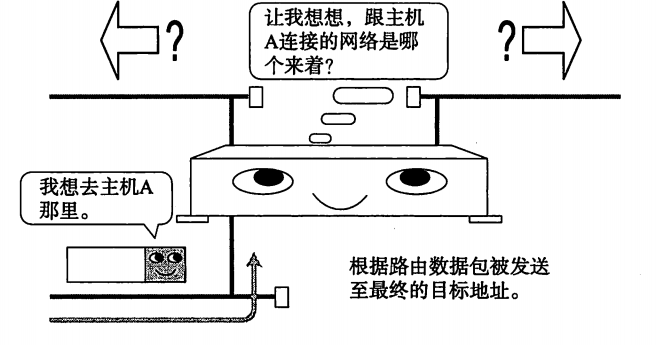
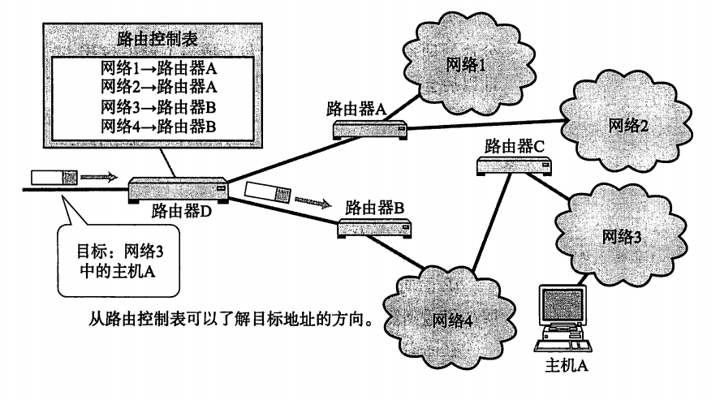
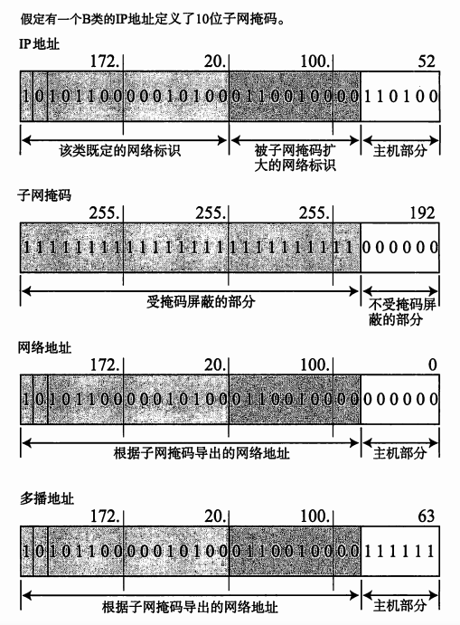
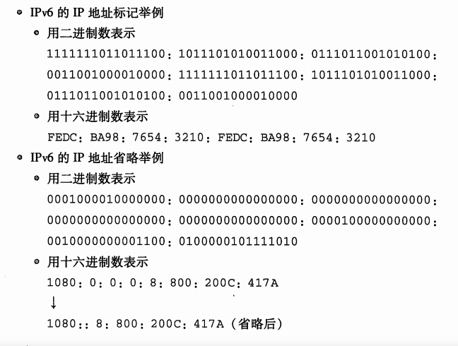

# 
 **《图解TCP/IP》** 

----------

## 第二章 TCP/IP基础知识

TCP(Transmission Control Protocol) IP(Internet Protocol)
### 背景

中央集中式容灾性较弱；

  
 

分组网络容灾性较强；

  
 

ARPANET，阿帕网，全球互联网的鼻祖，起初是为了连接美国西海岸大的大学研究所等四个节点。70年代，ARPANET的一个研究机构研发了TCP/IP。1982年， TCP/IP的具体规范才被定下来，1983年，称为阿帕网络唯一指定的协议。

### TCP/IP标准化

是指利用IP进行通信时所必须用到的协议群的统称。具体来说，IP或ICMP，TCP或UDP，TELNET或FTP，以及HTTP等都属于TCP/IP的协议。

  
 

#### 标准化精髓

标准化两大特点：

1. 开放性
2. 注重实用性

### TCP/IP 协议分层模型

#### TCP/IP与OSI参考模型

  
 

### TCP/IP分层模型与通信示例

## 第三章 数据链路

#### MAC地址
用于识别数据链路中互联的节点。长度为48比特。

## IP协议

IP相当于OSI参考模型的第三层网络层，主要作用是实现终端节点之间的通信。

IP的主要作用就是在复杂的网络环境中将数据包发给最终的目标地址。

  
 

#### 网络层与数据链路层的关系

数据链路层提供直连两个设备之间的通信功能。网络层负责在没有直连的两个网络之间进行通信传输。

  
 

### IP基础知识

IP大致分为三大作用模块：IP寻址、路由和IP分包与组包。
#### IP地址属于网络层地址
数据链路有MAC地址，网络层有IP地址。
IP地址用于在“连接到网络中的所有主机中识别出进行通信的目标地址”，所有的主机或路由器都必须设定自己的IP地址。

#### 路由控制

是将分组数据发送到最终目标地址的功能。若路由控制发生失常，可导致分组数据无法到达目标地址。

  
 

路由控制表：所有的主机都维持着一张路由控制表，为了将数据包发送给目标主机。记录着IP数据在下一步应该发给哪个路由器，IP包将根据路由控制表在各个数据链路上传输。

  
 

#### IP属于面向无连接型

在发包前，不需要建立与对端目标地址之间的连接。
IP采用面向无连接原因：

1. 为了简化
2. 为了提速
面向连接比起面向无连接处理相对复杂。甚至管理每个连接本身就是一个相当繁琐的事情。每次通信之前建立连接还会降低处理速度。需要有连接时可以委托上一层提供此项服务。因此，IP为了实现简单化与高速化采用面向无连接的方式。

为了提高可靠性，上一层的TCP采用面向有连接型。 可以说，IP只是负责将数据发送给目标主机，TCP负责保证目标主机确实接收到数据。

### IP地址

IP地址是由32位正整数来表示。TCP/IP通信要求将这样的IP地址分配给每一个参与通信的主机。

A类：
一个A类IP地址是指， 在IP地址的四段号码中，第一段号码为网络号码，剩下的三段号码为本地计算机的号码。如果用二进制表示IP地址的话，A类IP地址就由1字节的网络地址和3字节主机地址组成，网络地址的最高位必须是“0”。A类IP地址中网络的标识长度为8位，主机标识的长度为24位，A类网络地址数量较少，有126个网络，每个网络可以容纳主机数达1600多万台。

B类：
一个B类IP地址是指，在IP地址的四段号码中，前两段号码为网络号码。如果用二进制表示IP地址的话，B类IP地址就由2字节的网络地址和2字节主机地址组成，网络地址的最高位必须是“10”。B类IP地址中网络的标识长度为16位，主机标识的长度为16位，B类网络地址适用于中等规模的网络，有16384个网络，每个网络所能容纳的计算机数为6万多台。

C类：
一个C类IP地址是指，在IP地址的四段号码中，前三段号码为网络号码，剩下的一段号码为本地计算机的号码。如果用二进制表示IP地址的话，C类IP地址就由3字节的网络地址和1字节主机地址组成，网络地址的最高位必须是“110”。C类IP地址中网络的标识长度为24位，主机标识的长度为8位，C类网络地址数量较多，有209万余个网络。适用于小规模的局域网络，每个网络最多只能包含254台计算机。

D类：
D类IP地址在历史上被叫做多播地址(multicast address)，即组播地址。从第1位到第32位都是它的网络标识，灭有主机标识。在以太网中，多播地址命名了一组应该在这个网络中应用接收到一个分组的站点。多播地址的最高位必须是“1110”，范围从224.0.0.0到239.255.255.255。

E类：
一直未使用，240.0.0.0-255.255.255.255。

|类别|最大IP地址范围|最大主机数|私有IP地址范围|
|-|:-:|:-:|:-:|
|A|0.0.0.0-127.255.255.255|2^24-2=16777214|10.0.0.0-10.255.255.255|
|B|128.0.0.0-191.255.255.255|2^16-2=65534|172.16.0.0-172.31.255.255|
|C|192.0.0.0-223.255.255.255|2^8-2=254|192.168.0.0-192.168.255.255|
|D|224.0.0.0-239.255.255.255|- |- |
|E|240.0.0.0-255.255.255.255|- |- |
> 0,10,127等开头的A类地址都是具有特殊意义的保留地址。

#### 子网掩码

通过子网网络地址细分出比A类、B类、C类更小粒度的网络，使一个IP地址的网络标识和主机标识不再受限于改地址的类别。 子网掩码是将网络地址全变成1，主机地址全变成0；子网掩码可以灵活指定网络标识的长度。

  
 

#### CIDR无类型域间选路
采用任意长度分割IP地址和网络标识和主机标识。

### IPv6

#### IPv6的必要性

  IPv6是为了解决IPv4地址耗尽的问题而被标准化的网络协议。IPv6地址长度为IPv4的4倍，写成8个16为字节。
#### 特点

  * IP地址的扩大与路由控制表的聚合
  * 性能提升
  * 支持即插即用功能
  * 采用认证与加密功能
  * 多播、Mobile IP成为扩展功能

使用十六进制表示：

  
 

## IP协议相关技术

### 1. DNS 动态主机系统

DNS系统：可以有效管理主机名和IP地址之间对应关系。
在应用中，输入主机名时候，DNS会自动检索那个注册了主机名和IP地址的数据库，并且迅速定位对应的IP地址。
> 在Windows和linux中，使用**“nslookup 主机名”**命令查询对应的IP地址。
> 