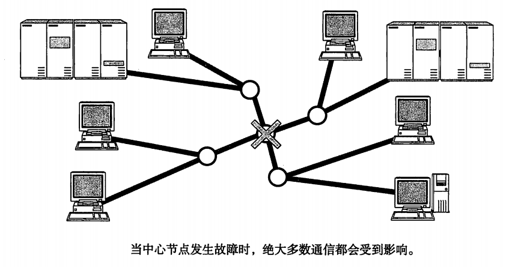
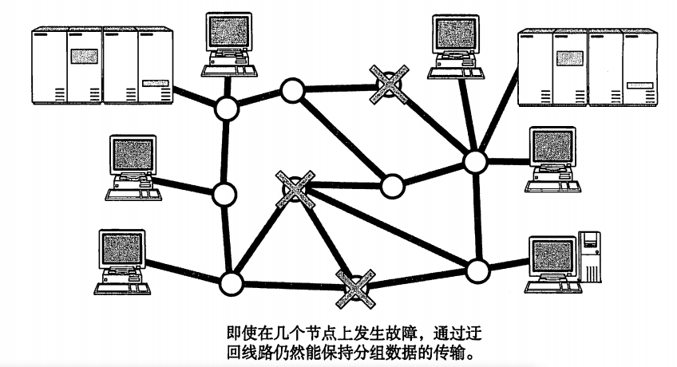
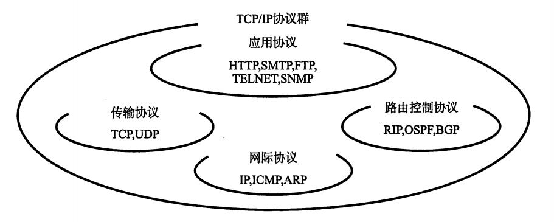
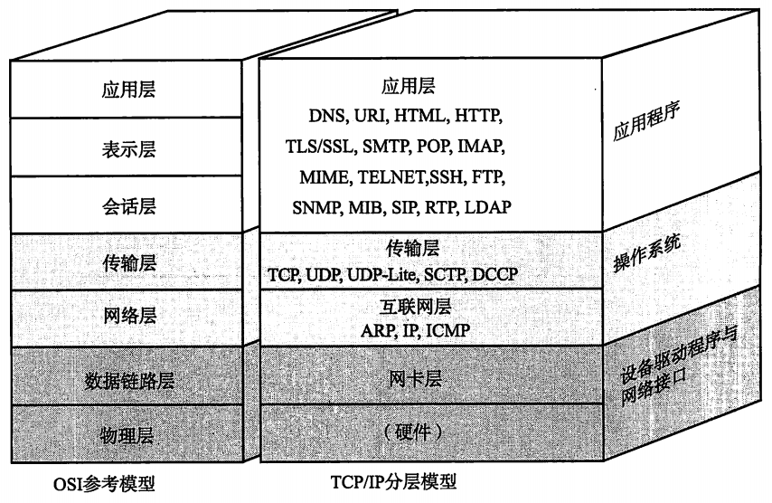
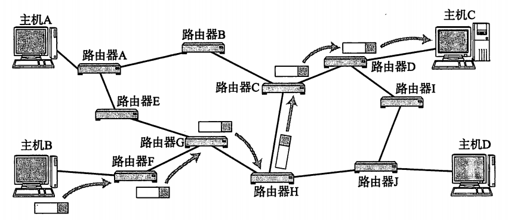
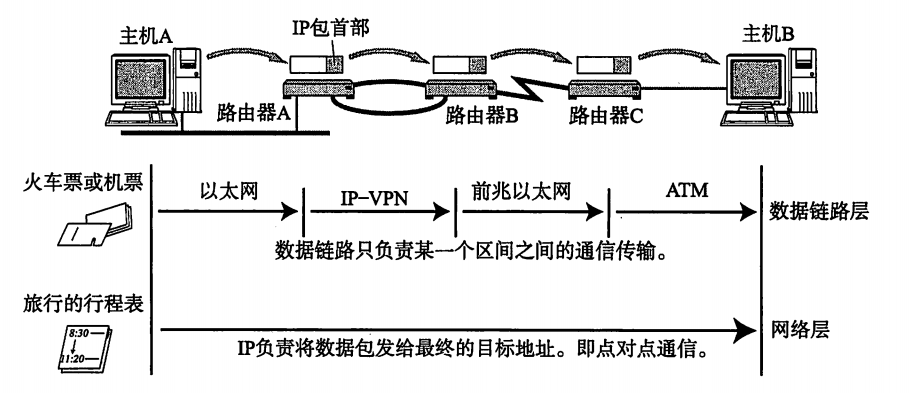

# **《图解TCP/IP》** 

----------

## 第二章 TCP/IP基础知识

TCP(Transmission Control Protocol) IP(Internet Protocol)
### 背景

中央集中式容灾性较弱；

  
 

分组网络容灾性较强；

  
 

ARPANET，阿帕网，全球互联网的鼻祖，起初是为了连接美国西海岸大的大学研究所等四个节点。70年代，ARPANET的一个研究机构研发了TCP/IP。1982年， TCP/IP的具体规范才被定下来，1983年，称为阿帕网络唯一指定的协议。

### TCP/IP标准化

是指利用IP进行通信时所必须用到的协议群的统称。具体来说，IP或ICMP，TCP或UDP，TELNET或FTP，以及HTTP等都属于TCP/IP的协议。

  
 

#### 标准化精髓

标准化两大特点：

1. 开放性
2. 注重实用性

### TCP/IP 协议分层模型

#### TCP/IP与OSI参考模型

  
 

### TCP/IP分层模型与通信示例

## 第三章 数据链路

#### MAC地址
用于识别数据链路中互联的节点。长度为48比特。

## IP协议

IP相当于OSI参考模型的第三层网络层，主要作用是实现终端节点之间的通信。

IP的主要作用就是在复杂的网络环境中将数据包发给最终的目标地址。

  
 

#### 网络层与数据链路层的关系

数据链路层提供直连两个设备之间的通信功能。网络层负责在没有直连的两个网络之间进行通信传输。

  
 

