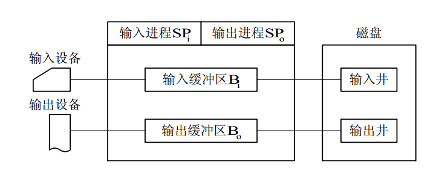

## 目录 ##

* 一、引论
* 二、进程管理
* 三、死锁
* 四、存储管理
* 五、设备管理
* 六、文件管理
* 接口
* 网络操作系统
* 系统安全性

# 第一章 操作系统引论 #

## 1.3 操作系统的基本特性 ##

（1）并发性

并行性是指两个或多个事件在同一时刻发生；而并发性是指两个或多个事件在同一时间间隔内发生。

在操作系统中引入进程的目的，就是为了使多个程序能并发执行。

引入进程：

为使多个程序能并发执行，系统必须分别为每个程序建立进程(Process)。简单说来，进程是指在系统中能独立运行并作为资源分配的基本单位，它是由一组机器指令、数据和堆栈等组成的，是一个能独立运行的活动实体。多个进程之间可以并发执行和交换信息。一个进程在运行时需要一定的资源，如 CPU、存储空间及 I/O 设备等。

引入线程：

通常在一个进程中可以包含若干个线程，它们可以利用进程所拥有的资源。在引入线
程的 OS 中，通常都是把进程作为分配资源的基本单位，而把线程作为独立运行和独立调度
的基本单位。由于线程比进程更小，基本上不拥有系统资源，故对它的调度所付出的开销
就会小得多，能更高效地提高系统内多个程序间并发执行的程度。因而近年来推出的通用
操作系统都引入了线程，以便进一步提高系统的并发性，并把它视作现代操作系统的一个
重要标致。

（2）共享性

所谓共享(Sharing)，是指系统中的资源可供内存中多个并发执行
的进程(线程)共同使用，相应地，把这种资源共同使用称为资源共享，或称为资源复用。

- 互斥共享方式
- 同时访问方式

（3）虚拟技术

通过某种技术把一个物理实体变为若干个逻辑上的对应物。实现方式有以下两种：

- 时分复用技术：分时使用方式。
- 空分复用技术：将一个较宽的信道划分为多个窄的子信道。

（4）异步性

进程是以人们不可预知的速度向前推进，此即进程的异步性(Asynchronism)。

## 1.4 操作系统的主要功能 ##

（1）处理机管理功能：

- 进程控制：为作业创建进程，撤消已结束的进程，以及控制进程在运行过程中的状态转换。
- 进程同步：为多个进程(含线程)的运行进行协调。
- 进程通信：实现在相互合作的进程之间的信息交换。
- 调度： 作业调度和进程调度。

（2）存储器管理功能

- 内存分配
- 内存保护：确保每道用户程序都只在自己的内存空间内运行，彼此互不干扰；
- 地址映射：
- 内存扩充：

（3）设备管理功能

完成用户进程提出的 I/O 请求；为用户进程分配其所需的 I/O 设备；提高 CPU 和 I/O 设备的利用率；提高 I/O 速度；方便用户使用 I/O 设备。

- 缓冲管理：
- 设备分配：
- 设备分配：

（4）文件管理功能

- 文件存储空间的管理
- 目录管理
- 文件的读/写管理和保护

（5）操作系统与用户之间的接口

- 用户接口
- 程序接口

## 1.5 OS 结构设计 ##

客户/服务器(Client/Server)模式：客户/服务器系统主要由客户机、服务器和网络系统三个部分组成。

**客户/服务器模式的优点：**

- 数据的分布处理和存储。
- 便于集中管理。
- 易于改编应用软件。
- 灵活性和可扩充性。

### 微内核 ###

- 足够小的内核
- 基于客户/服务器模式
- 应用“机制与策略分离”原理
- 采用面向对象技术

# 第二章 进程管理 

## 2.1 进程的基本概念 ##

### 进程的三种基本状态 ###

- 就绪(Ready)状态
- 执行状态
- 阻塞状态

<src img="https://github.com/zephyrus9/Notes-of-books-in-Xmind/blob/master/pics/进程三种状态.PNG"> 

### 进程控制块 ###

为了描述和控制进程的运行，系统为每个进程定义了一个数据结构——进程控制块PCB(Process Control Block)，它是进程实体的一部分，是操作系统中最重要的记录型数据结构。

进程控制块中的信息：

- 进程标识符
- 处理机状态
- 进程调度信息
- 进程控制信息

## 2.2 进 程 控 制 ##

用于创建一个新进程，终止一个已完成的进程，或终止一个因出现某事件而使其无法运行下去的进程，还可负责进程运行中的状态转换。
进程控制一般是由 OS的内核中的原语来实现的。

原语(Primitive)是由若干条指令组成的，用于完成一定功能的一个过程。它与一般过程的区别在于：它们是“原子操作(Action Operation)”。所谓原子操作，是指一个操作中的所有动作要么全做，要么全不做。

进程的创建(Creation of Process)
一旦操作系统发现了要求创建新进程的事件后，便调用进程创建原语 Creat( )按下述步骤创建一个新进程。

1. 申请空白 PCB。
1. 为新进程分配资源。
1. 初始化进程控制块。
1. 将新进程插入就绪队列，如果进程就绪队列能够接纳新进程，便将新进程插入就绪队列。

## 2.3 进 程 同 步 ##

对多个相关进程在执行次序上进行协调，以使并发执行的诸进程之间能有效地共享资源和相互合作，从而使程序的执行具有可再现性。

**生产者-消费者(producer-consumer)问题**是一个著名的进程同步问题。它描述的是：有一群生产者进程在生产产品，并将这些产品提供给消费者进程去消费。为使生产者进程与消费者进程能并发执行，在两者之间设置了一个具有 n 个缓冲区的缓冲池，生产者进程将它所生产的产品放入一个缓冲区中；消费者进程可从一个缓冲区中取走产品去消费。尽管所有的生产者进程和消费者进程都是以异步方式运行的，但它们之间必须保持同步，即不允许消费者进程到一个空缓冲区去取产品，也不允许生产者进程向一个已装满产品且尚未被取走的缓冲区中投放产品。

## 2.4 经典进程的同步问题 ##

### 生产者—消费者问题 ###

### 哲学家进餐问题 ###

问题是描述有五个哲学家共用一张圆桌，分别坐在周围的五张椅子上，在圆桌上有五个碗和五只筷子，他们的生活方式是交替地进行思考和进餐。平时，一个哲学家进行思考，饥饿时便试图取用其左右最靠近他的筷子，只有在他拿到两只筷子时才能进餐。进餐完毕，放下筷子继续思考。

## 2.5 进 程 通 信 ##

进程通信，是指进程之间的信息交换，其所交换的信息量少者是一个状态或数值，多者则是成千上万个字节。

## 2.6 线 程 ##

20 世纪 80 年代中期，人们又提出了比进程更小的能独立运行的基本单位——线程(Threads)，试图用它来提高系统内程序并发执行的程度，从而可进一步提高系统的吞吐量。

线程的引入：

如果说，在操作系统中引入进程的目的，是为了使多个程序能并发执行，以提高资源利用率和系统吞吐量，那么，在操作系统中再引入线程，则是为了减少程序在并发执行时所付出的时空开销，使 OS 具有更好的并发性。

进程的两个基本属性：

1. 进程是一个可拥有资源的独立单位；
1. 进程同时又是一个可独立调度和分派的基本单位。

**线程与进程的比较**

1. 调度：传统的进程拥有资源的基本单位和独立调度、分排的基本单位；而拥有线程的OS中，将线程作为基本的单位。同一进程中，线程的切换不会引起进程的切换，但是从一个进程中的线程到另一个进程中的线程切换，会引起进程的切换。
2. 并发性 ：在引入线程的操作系统中，不仅进程之间可以并发执行，而且在一个进程中的多个线程之间亦可并发执行，使得操作系统具有更好的并发性，从而能更加有效地提高系统资源的利用率和系统的吞吐量。
3. 拥有资源：进程拥有资源，是系统中拥有资源的最后一个基本单位。一般而言，线程自己不拥有系统资源，但是可以访问其隶属的资源池，即一个进程的代码段、数据段及所拥有的系统资源。
4. 系统开销：在一些操作系统中，线程的切换、同步和通信都无须操作系统内核的干预。

### 线程间的同步和通信 ###
为使系统中的多线程能有条不紊地运行，在系统中必须提供用于实现线程间同步和通信的机制。为了支持不同频率的交互操作和不同程度的并行性，在多线程 OS 中通常提供多种同步机制，如互斥锁、条件变量、计数信号量以及多读、单写锁等。

# 第三章 处理机调度与死锁 #

## 调度算法 ##

根据系统的资源分配策略所规定的资源分配算法。

- 先来先服务调度算法 FCFS

该算法既可用于作业调度，也可用于进程调度。FCFS 算法比较有利于长作业(进程)，而不利于短作业(进程)。

- 短作业(进程)优先调度算法 SJ(P)F

指对短作业或短进程优先调度的算法。

- 基于时间片的轮转调度算法

在分时系统中，为保证能及时响应用户的请求，必须采用基于时间片的轮转式进程调度算法。

## 死锁 ##

所谓死锁(Deadlock)，是指多个进程在运行过程中因争夺资源而造成的一种僵局(DeadlyEmbrace)，当进程处于这种僵持状态时，若无外力作用，它们都将无法再向前推进。

**死锁产生的原因：**

1. 竞争资源。
1. 进程之间推进顺序非法。

**产生死锁的必要条件：**

1. 互斥条件。指进程对所分配到的资源进行排它性使用，即在一段时间内某资源只由一个进程占用。
1. 请求和保持条件。指进程已经保持了至少一个资源，但又提出了新的资源请求，而该资源又已被其它进程占有，此时请求进程阻塞，但又对自己已获得的其它资源保持不放。
1. 不剥夺条件。指进程已获得的资源，在未使用完之前，不能被剥夺，只能在使用完时由自己释放
1. 环路等待条件。指在发生死锁时，必然存在一个进程——资源的环形链。

**处理死锁的基本方法：**

1. 预防死锁。通过设置某些限制条件，去破坏产生死锁的四个必要条件中的一个或几个条件，来预防发生死锁。
1. 避免死锁。在资源的动态分配过程中，用某种方法去防止系统进入不安全状态，从而避免发生死锁。
1. 检测死锁。允许系统在运行过程中发生死锁。但可通过系统所设置的检测机构，及时地检测出死锁的发生，并精确地确定与死锁有关的进程和资源； 然后，采取适当措施，从系统中将已发生的死锁清除掉。
1. 解除死锁。常用的实施方法是撤消或挂起一些进程，以便回收一些资源，再将这些资源分配给已处于阻塞状态的进程，使之转为就绪状态，以继续运行。死锁的检测和解除措施有可能使系统获得较好的资源利用率和吞吐量，但在实现上难度也最大。

## 预防死锁的方法 ##

预防死锁

1. 摒弃“请求和保持”条件
2. 摒弃“不剥夺”条件
3. 摒弃“环路等待”条件

### 利用银行家算法避免死锁 ###

5/27/2018 2:18:47 PM 
## 3.7 死锁的检测与解除 ##

死锁解除：

1. 剥夺资源。
1. 撤销进程。

# 第四章 存 储 器 管 理 #

现代计算机系统中，存储部件通常是采用层次结构来组织的。

多级存储器结构

存储层次至少具有三级：最高级为CPU寄存器，中间为主存，最底层是辅存。

**分区分配算法**

- 首次适应算法(first fit)

FF 算法要求空闲分区链以地址递增的次序链接。在分配内存时，从链首开始顺序查找，直至找到一个大小能满足要求的空闲分区为止；然后再按照作业的大小，从该分区中划出一块内存空间分配给请求者，余下的空闲分区仍留在空闲链中。

- 循环首次适应算法(next fit)

在为进程分配内存空间时，不再是每次都从链首开始查找，而是从上次找到的空闲分区的下一个空闲分区开始查找，直至找到一个能满足要求的空闲分区，从中划出一块与请求大小相等的内存空间分配给作业。

- 最佳适应算法(best fit)

所谓“最佳”是指每次为作业分配内存时，总是把能满足要求、又是最小的空闲分区分配给作业，避免“大材小用”。为了加速寻找，该算法要求将所有的空闲分区按其容量以从小到大的顺序形成一空闲分区链。这样，第一次找到的能满足要求的空闲区，必然是最佳的。

- 最坏适应算法(worst fit)

最坏适应分配算法要扫描整个空闲分区表或链表，总是挑选一个最大的空闲区分割给作业使用，其优点是可使剩下的空闲区不至于太小，产生碎片的几率最小，对中、小作业有利，同时最坏适应分配算法查找效率很高。

- 快速适应算法(quick fit)

该算法又称为分类搜索法，是将空闲分区根据其容量大小进行分类，对于每一类具有相同容量的所有空闲分区，单独设立一个空闲分区链表，这样，系统中存在多个空闲分区链表，同时在内存中设立一张管理索引表，该表的每一个表项对应了一种空闲分区类型，并记录了该类型空闲分区链表表头的指针。

### 哈希算法 ###

哈希算法就是利用哈希快速查找的优点，以及空闲分区在可利用空间表中的分布规律，
建立哈希函数，构造一张以空闲分区大小为关键字的哈希表，该表的每一个表项记录了一
个对应的空闲分区链表表头指针。

## 4.4 基本分页存储管理方式 ##

### 页面 ###

分页存储管理是将一个进程的逻辑地址空间分成若干个大小相等的片，称为页面或页

### 页表 ###

在分页系统中，允许将进程的各个页离散地存储在内存不同的物理块中，但系统应能
保证进程的正确运行，即能在内存中找到每个页面所对应的物理块。为此，系统又为每个
进程建立了一张页面映像表，简称页表。
页表
的作用是实现从页号到物理块号的地址映射。

## 4.6 虚拟存储器 ##

## 4.8 页面置换算法 ##

通常，把选择换出页面的算法称为页面置换算法(Page-Replacement Algorithms)。

1．最佳(Optimal)置换算法

最佳置换算法是由 Belady于 1966年提出的一种理论上的算法。其所选择的被淘汰页面，
将是以后永不使用的，或许是在最长(未来)时间内不再被访问的页面。采用最佳置换算法，
通常可保证获得最低的缺页率。但由于人们目前还无法预知一个进程在内存的若干个页面
中，哪一个页面是未来最长时间内不再被访问的，因而该算法是无法实现的，但可以利用
该算法去评价其它算法。

2．先进先出(FIFO)页面置换算法

该算法总是淘汰最先进入内存的页面，即选择在内存中驻
留时间最久的页面予以淘汰。该算法实现简单，只需把一个进程已调入内存的页面，按先
后次序链接成一个队列，并设置一个指针，称为替换指针，使它总是指向最老的页面。但
该算法与进程实际运行的规律不相适应，因为在进程中，有些页面经常被访问，比如，含
有全局变量、常用函数、例程等的页面，FIFO 算法并不能保证这些页面不被淘汰。

3．最近最久未使用(LRU)置换算法

4．简单的 Clock 置换算法

5．改进型 Clock 置换算法

6．最少使用(LFU：Least Frequently Used)置换算法

7．页面缓冲算法(PBA：Page Buffering Algorithm)

# 第五章 设 备 管 理 #
设备管理的对象主要是 I/O 设备，还可能要涉及到设备控制器和 I/O 通道。
而设备管理的基本任务是完成用户提出的 I/O 请求，提高 I/O 速率以及提高 I/O 设备的利用率。
设备管理的主要功能有: 缓冲区管理、设备分配、设备处理、虚拟设备及实现设备独立性等。

## 5.1 I/O 系统 ##

I/O 系统是用于实现**数据输入、输出及数据存储**的系统。

1．I/O 设备的类型

I/O 设备的类型繁多，从 OS 观点看，其重要的性能指标有: 设备使用特性、数据传输
速率、数据的传输单位、设备共享属性等。因而可从不同角度对它们进行分类。

1) 按设备的使用特性分类

第一类是存储设备，也称外存或后备存储器、
辅助存储器，是计算机系统用以存储信息的主要设备。该类设备存取速度较内存慢，但容
量比内存大得多，相对价格也便宜。第二类就是输入/输出设备，又具体可分为输入设备、
输出设备和交互式设备。

2) 按传输速率分类

第一类是低速设备，这是指其传输速率仅
为每秒钟几个字节至数百个字节的一类设备。属于低速设备的典型设备有键盘、鼠标器、
语音的输入和输出等设备。第二类是中速设备，这是指其传输速率在每秒钟数千个字节至
数十万个字节的一类设备。典型的中速设备有行式打印机、 激光打印机等。第三类是高速
设备，这是指其传输速率在数百个千字节至千兆字节的一类设备。典型的高速设备有磁带
机、磁盘机、光盘机等。

3) 按信息交换的单位分类

第一类是块设备(Block Device)，这类设备用于存储信息。第二类是字符设备(Character Device)，用于数据的输入和输出。

4) 按设备的共享属性分类

(1) 独占设备。

(2) 共享设备。

(3) 虚拟设备。

2．设备与控制器之间的接口

## 5.2 I/O 控制方式 ##

## 5.3 缓 冲 管 理 ##

缓冲管理的主要职
责是组织好这些缓冲区，并提供获得和释放缓冲区的手段。

(1) 缓和 CPU 与 I/O 设备间速度不匹配的矛盾。

(2) 减少对 CPU 的中断频率，放宽对 CPU 中断响应时间的限制。

(3) 提高 CPU 和 I/O 设备之间的并行性。

## 5.4 I/O 软 件 ##

### SPOOLing 技术 ###

为了缓和 CPU 的高速性与 I/O 设备低速性间的矛盾而引入了脱机输入、脱机输出技术。

SPOOLing 技术便可将一台物理 I/O 设备虚拟为多台逻辑 I/O 设备，同样允许多个用户共享一台物理 I/O设备。

#### SPOOLing 系统主要有以下三部分： ####

(1) 输入井和输出井。

(2) 输入缓冲区和输出缓冲区。

(3) 输入进程 SPi和输出进程 SPo。

  
 

#### SPOOLing 系统的特点: ####

(1) 提高了I/O 的速度。

(2) 将独占设备改造为共享设备。

(3) 实现了虚拟设备功能。

## 5.6 磁盘存储器的管理 ##

# 第六章 文件管理 #

# 参考文献 #

1. 《计算机操作系统(第三版)》 汤子瀛
2. 